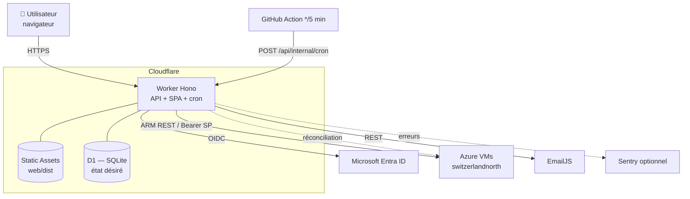
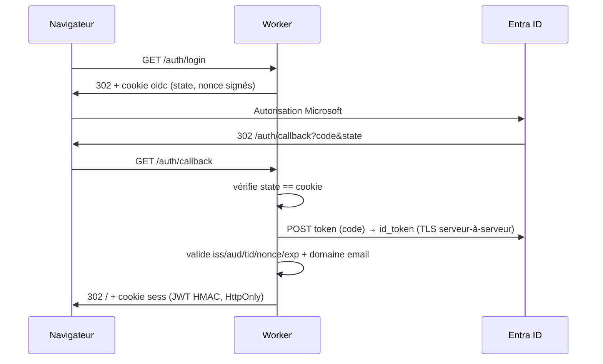
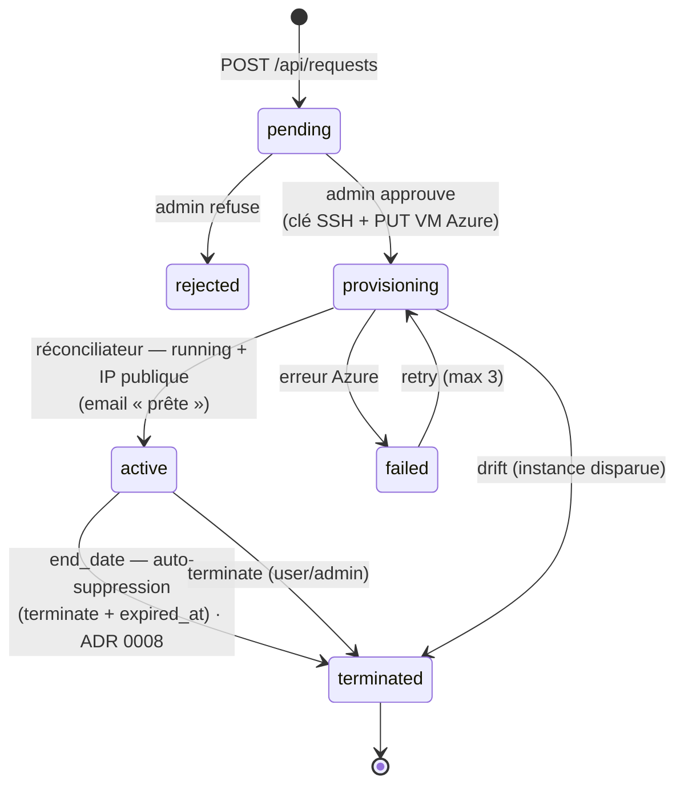
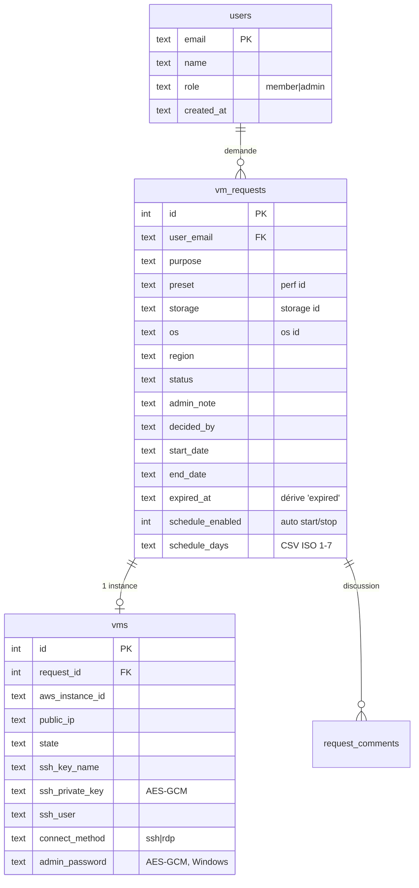
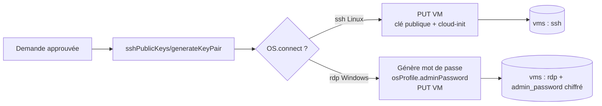

# Architecture — GIT VM Portal

> Vue technique du système : composants, flux, modèle de données, sécurité.
> Voir aussi [`../AGENTS.md`](../AGENTS.md), les [ADR](adr/) et [`DEPLOYMENT.md`](DEPLOYMENT.md).
> Dernière mise à jour : 2026-06-19.

---

## 1. Vue d'ensemble

Une seule unité déployable (un **Cloudflare Worker**) sert à la fois la **SPA React** (static assets)
et l'**API JSON** (Hono), et exécute le **réconciliateur**. L'état désiré vit dans **D1** ; le réel vit
dans **Azure Virtual Machines** ; le réconciliateur réconcilie les deux en continu (piloté par une
GitHub Action qui appelle `/api/internal/cron` — voir [DEPLOYMENT.md](DEPLOYMENT.md) §9).

## 2. Composants

| Composant | Rôle | Fichiers |
|---|---|---|
| **Worker (API)** | Routes OIDC + API JSON + cron `scheduled()` | `src/index.ts` |
| **OIDC** | Flux authorization-code Entra ID (sans librairie) | `src/oidc.ts` |
| **Crypto** | JWT HMAC (sessions), AES-GCM (clés SSH + mots de passe Windows) | `src/crypto.ts` |
| **DB** | Accès D1 (requests, vms, users, audit, comments, metrics) | `src/db.ts` |
| **Azure** | Client ARM REST (auth service-principal, JSON) — VM, disques, snapshots, métriques, coûts | `src/azure.ts` |
| **Catalogue** | PERF × STORAGE × OS + coûts (source de vérité) | `src/presets.ts` |
| **Email** | Notifications EmailJS | `src/email.ts` |
| **SPA** | UI React (auth, Mes VM, Créer une VM, Détail, Admin) | `web/src/` |

## 3. Authentification (OIDC Entra ID)

Flux authorization-code, **entièrement côté Worker** ; le navigateur ne voit jamais le `id_token`.
Session = **JWT signé HMAC** dans un cookie `HttpOnly; Secure; SameSite=Lax` (TTL 8 h).

Garde-fous : `ALLOWED_EMAIL_DOMAINS` (domaines autorisés), `ADMIN_EMAILS` (admins bootstrap).
Diagnostic des pannes de login : [`analyse/04-diagnostic-login.md`](analyse/04-diagnostic-login.md).

## 4. Cycle de vie d'une demande

`approve` crée la clé/instance de façon **synchrone** ; le passage `provisioning → active` est fait
par la **cron** quand l'instance tourne avec une IP. À l'échéance, la VM est **supprimée**
(terminate) et `expired_at` est posé pour tracer l'auto-expiration — voir
[ADR 0008](adr/0008-suppression-auto-a-l-echeance.md) (supersède [ADR 0004](adr/0004-cycle-de-vie-reconciliateur.md)).

## 5. Le réconciliateur (cœur de la robustesse)

**DB = état désiré.** Le pipeline (`src/index.ts`) est **piloté en externe** par une GitHub Action —
les 5 slots de cron Cloudflare du compte sont pris par les autres variantes (voir
[DEPLOYMENT.md](DEPLOYMENT.md) §9). Le handler `scheduled()` reste prêt pour un retour au cron natif.

| Appel (GitHub Action) | Fonction | Effet |
|---|---|---|
| `POST /api/internal/cron` (5 min) | `reconcile` + `applySchedules` + `retryFailed` + `enforceExpiry` + `enforceIdleStop` + `syncSnapshots` | sync Azure↔DB, drift, plannings, retries, échéances, idle-stop, snapshots |
| `…?job=stop` (19 h) | `scheduledStop` | arrête les VM running sans planning (garde-fou coûts) |

- **`reconcile`** : `provisioning → active` (running + IP, + email), drift (instance disparue →
  `terminated`), sync de l'état running/stopped + IP.
- **`applySchedules`** : applique les **plannings auto start/stop** par VM (état désiré, Europe/Zurich) :
  dans la fenêtre + jour coché → la VM doit tourner, sinon arrêtée. `scheduledStop` (19 h) ignore ces VM.
- **`retryFailed`** : relance les provisioning échoués sans instance (max 3, compté dans l'audit log).
- **`enforceExpiry`** : à `end_date` → **supprime** la VM (terminate instance + clé) + `expired_at` +
  email ; e-mail de pré-échéance 24 h avant (sauvegarde) — [ADR 0008](adr/0008-suppression-auto-a-l-echeance.md).

> 🔒 **Règle** : toute nouvelle automatisation de cycle de vie **s'ajoute au réconciliateur**, pas
> dans un mécanisme parallèle.

## 6. Modèle de données (D1)

Migrations **100 % additives** (`ADD COLUMN`) pour éviter toute reconstruction de table sur D1 remote.

> 🔁 **Note Azure** : les colonnes `aws_instance_id` et `aws_snapshot_id` sont **conservées** (règle
> additive) mais stockent désormais des identifiants Azure opaques — respectivement le **nom de
> ressource de la VM** (`gitvm-req-<id>`) et le **nom du snapshot**.

## 7. Catalogue & provisioning

Une demande compose **PERF** (taille de VM Azure) × **STORAGE** (disque managé) × **OS** (image
Marketplace). Les images sont des **URN vérifiées** (`scripts/azure-images.mjs`). Le provisioning crée
**IP publique + NIC + VM** (NIC/IP/disque en `deleteOption: Delete` → la suppression de la VM cascade).

- **Linux** → SSH avec la clé privée téléchargeable (chiffrée au repos) ; outils de cours +
  durcissement via **cloud-init** (`customData`).
- **Windows** → RDP. Mot de passe **généré**, posé directement par Azure (`osProfile.adminPassword`),
  **chiffré AES-GCM**, révélé au propriétaire via `GET /api/requests/:id/password` (audité). Le
  durcissement in-VM + outils de cours sont appliqués par le réconciliateur via l'**extension
  CustomScript** à la 1ʳᵉ activation. Nécessite le **port 3389** ouvert sur le NSG. Voir
  [ADR 0007](adr/0007-catalogue-os-et-windows-rdp.md).

## 8. Sécurité

| Aspect | Mise en œuvre |
|---|---|
| Auth | OIDC Entra ID in-Worker ; id_token jamais exposé au navigateur |
| Sessions | JWT HMAC signé maison, cookie `HttpOnly; Secure; SameSite=Lax` |
| Secrets d'exécution | Cloudflare Wrangler Secrets (jamais commités) — [ADR 0006](adr/0006-gestion-des-secrets.md) |
| Données sensibles au repos | Clés SSH **et** mots de passe Windows **chiffrés AES-GCM** (clé dérivée de `SESSION_SECRET`) |
| Contrôle d'accès | Clé/mot de passe récupérables **uniquement** par le propriétaire ou un admin |
| Traçabilité | `audit_log` sur login, demande, décision, provisioning, téléchargement clé, révélation mot de passe |
| Rate limiting | Max 5 demandes / heure / utilisateur |

## 9. Réseau Azure

Resource group `git-vm-portal`, **1 VNet** (`git-vm-portal-vnet`, 10.10.0.0/16) + **1 subnet**
(`default`) + **1 NSG** partagé (`git-vm-portal-nsg`, `switzerlandnorth`). Ingress : **tcp/22** (SSH)
et **tcp/3389** (RDP Windows). IP publique Standard par VM (`scripts/azure-setup.mjs`). Egress
verrouillable en default-deny + allowlist via `scripts/azure-harden-nsg.mjs`.

> ⚠️ **Limites connues** : pas d'isolation réseau par classe/cours (un seul subnet + NSG) ; 22/3389
> ouverts en `Internet` pour la démo (**à restreindre** en prod). Le compte « Azure for Students »
> plafonne à **3 IP publiques / région → 3 VM concurrentes** et **6 vCPU**.

## 10. Surface API

| Méthode | Route | Auth | Rôle |
|---|---|---|---|
| GET | `/auth/login`, `/auth/callback` · POST `/auth/logout` | — | OIDC |
| GET | `/healthz`, `/api/me`, `/api/presets` | public / session | — |
| GET/POST | `/api/requests` | session | lister / créer |
| GET | `/api/requests/:id` · `/live` | propriétaire/admin | détail / état live |
| GET | `/api/requests/:id/key` · `/password` | propriétaire/admin | clé SSH / mot de passe RDP |
| POST | `/api/requests/:id/terminate` · `/start` · `/stop` · `/reboot` | propriétaire/admin | actions VM |
| GET/POST | `/api/requests/:id/comments` | propriétaire/admin | discussion |
| GET | `/api/admin/requests[.csv]` · `/stats` · `/metrics` · `/users` | admin | console |
| POST | `/api/admin/requests/:id/approve` · `/reject` · `/users/:email/role` | admin | validation / rôles |
| ALL | `*` | — | fallback SPA (static assets) |
